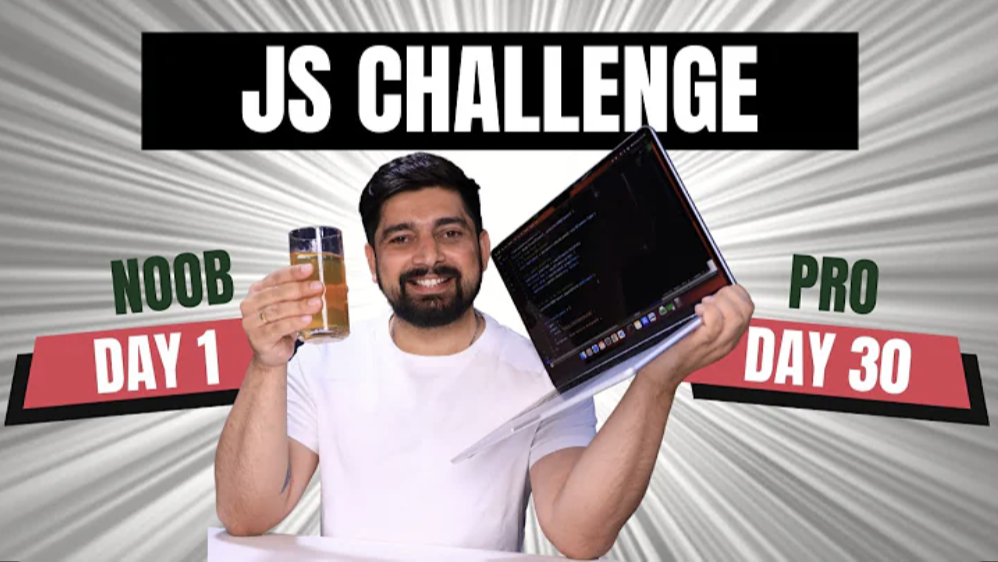

# 30 Days of JavaScript Challenges

This is a 30-day challenge to help you learn JavaScript. Each day, you will complete a new challenge that will teach you a new concept or skill.

# **Daily Log**

| Day | Challenge | What I Learned |
|---|---|---|
| 1 | Variables and DataTypes | How to declare variables using `var`, `let`, and `const`. Understand the different data types in JavaScript. Be able to use the `typeof` operator to identify the data type of a variable. Understand the concept of variable reassignment and the immutability of `const` variables. |

**Stretch Goals**

*  Try coming up with your own variables and data types.
*  Experiment with the `typeof` operator on different values.

| Day | Challenge | What I Learned |
|---|---|---|
| 2 | Operators | How to use arithmetic operators to perform basic calculations in JavaScript. Use `Assignment operators` to modify varialble values. Use `Comparison operators` for compare values. Use `Logical operators` for combine conditions. Use `Ternary operators` for concise conditional expressions.|

**Stretch Goals**

* Try writing your own script that uses arithmetic operators to solve a specific problem.
* Experiment with the order of operations `PEMDAS` in JavaScript.

| Day | Challenge | What I Learned |
|---|---|---|
| 3 | Control Structures | Understand basic `if-else` control flow. Use `nested if-else` statements to handle multiple conditions. Utilize `switch cases` for control flow based on specific values. Use `ternary operator` for concise condition checking. Combine multiple conditions to solve more omplex problems. |

**Stretch Goals**

* Experiment with more complex conditional statements combining multiple operators.

| Day | Challenge | What I Learned |
|---|---|---|
| 4 | Loops | Understand and use for `Loops` to iterate over a sequence of numbers. Utilize `while loops` for iteration. Apply `do... while loops` to ensure the loop body is executed at least once. Implement `nested loops` to solve more complex problems. Use loop control statements (`break` and `continue`) to control the flow of loops. |

**Stretch Goals**

* Experiment with different loop control statements (`break` and `continue`) to manipulate the flow of loops.
* Explore different types of loops in JavaScript.
* Practice optimizing your loops for better performance by minimizing unnecessary iterations.
* Challenge yourself by implementing a recursive function using loops.

| Day | Challenge | What I Learned |
|---|---|---|
| 5 | Functions | Understand and define `functions` using `function declarations`, `expressions`, and `arrow functions`. use `function parameters` and `default values` effectively. create and utilize `higher-order` functions. Apply functions to solve common problems and perform calculations. Enhance `code reusability` and orgranization using functions. |

**Stretch Goals**

1. Explore different ways to define functions in JavaScript, such as using function expressions and arrow functions.
2. Practice using function parameters to pass data into functions and make them more flexible.